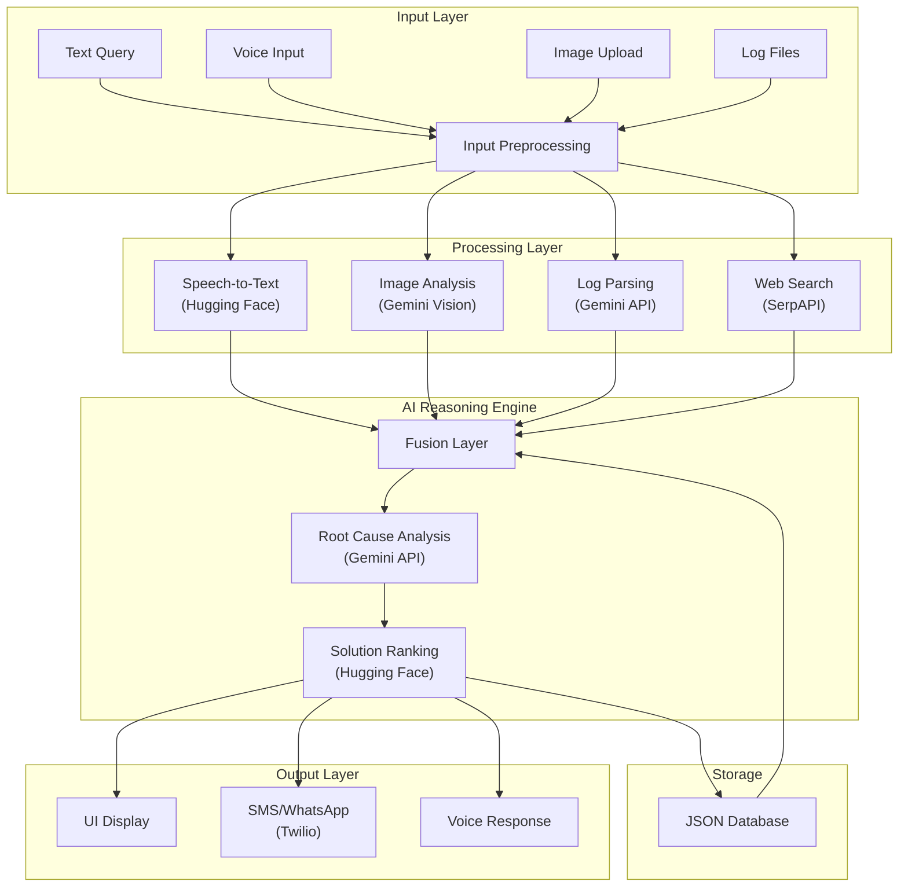

# SmartFix-AI Architecture

## Component Details

### Input Layer
- **Text Query**: Direct text input from the user interface
- **Voice Input**: Audio recordings converted to text
- **Image Upload**: Screenshots of errors or device issues
- **Log Files**: System or application logs for analysis

### Processing Layer
- **Speech-to-Text**: Converts voice inputs to text using Hugging Face models
- **Image Analysis**: Extracts information from images using Gemini Vision
- **Log Parsing**: Analyzes log files to identify errors and patterns
- **Web Search**: Retrieves relevant solutions from the internet using SerpAPI

### AI Reasoning Engine
- **Fusion Layer**: Combines all inputs into a unified representation
- **Root Cause Analysis**: Identifies the likely cause of the issue using Gemini API
- **Solution Ranking**: Ranks possible solutions based on relevance and effectiveness

### Output Layer
- **UI Display**: Presents solutions through an interactive user interface
- **SMS/WhatsApp**: Sends notifications and updates via Twilio
- **Voice Response**: Provides audio feedback for hands-free operation

### Storage
- **JSON Database**: Stores user queries, solutions, and feedback for future reference
