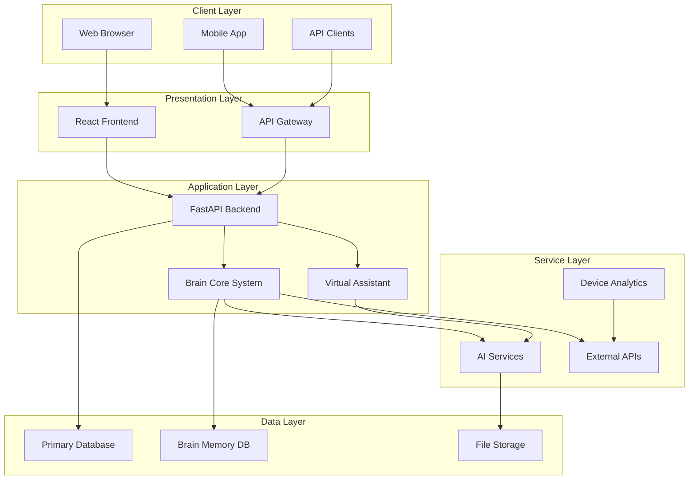
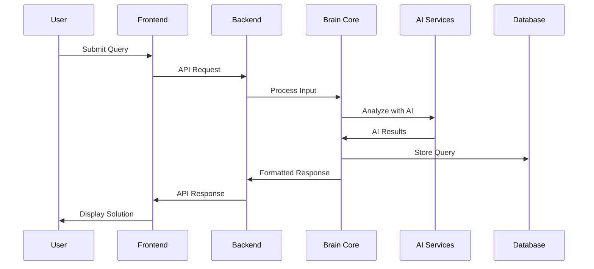
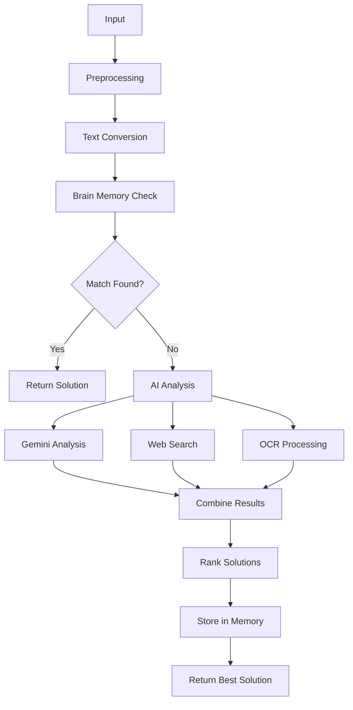
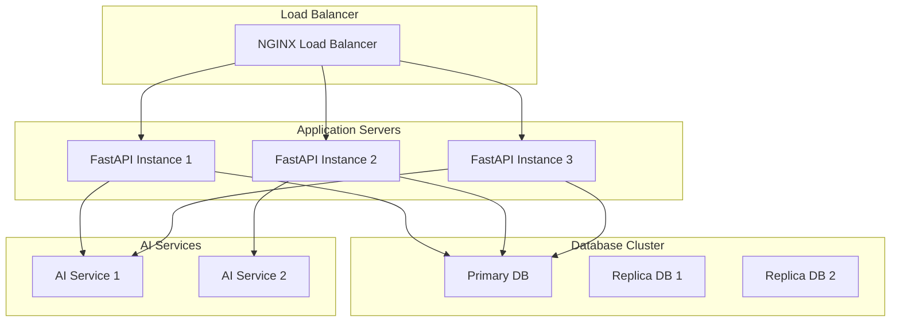

# SmartFix-AI Detailed Architecture

## System Overview

SmartFix-AI is built as a microservices-based architecture with clear separation of concerns, enabling scalability, maintainability, and extensibility.

### High-Level Architecture



## Core Components

### Brain Core System

The intelligent orchestrator that coordinates all AI processing:

```python
class BrainCore:
    def __init__(self):
        self.brain_memory = BrainMemory()
        self.hf_service = HuggingFaceService()
        self.gemini_service = GeminiService()
        self.serp_service = SerpAPIService()
        self.ocr_service = OCRService()
```

**Key Responsibilities:**
- Input Processing: Converts all input types to text
- Memory Management: Stores and retrieves solutions
- AI Coordination: Manages multiple AI models
- Learning Engine: Improves from user feedback
- Solution Ranking: Prioritizes solutions by confidence

### AI Services Layer

#### HuggingFace Service
- Speech-to-text conversion
- Text analysis and intent classification
- Entity extraction

#### Gemini Service
- Advanced problem analysis
- Solution generation
- Contextual understanding

#### OCR Service
- Image text extraction
- Error code detection
- Pattern recognition

#### SerpAPI Service
- Web search for solutions
- Real-time information retrieval
- External resource integration

### Virtual Assistant

Interactive chat-based troubleshooting system with:
- Natural language conversation
- Session management
- Quick actions
- Voice integration

### Device Analytics

Comprehensive system monitoring:
- Health monitoring
- Performance metrics
- Security analysis
- Hardware diagnostics

## Data Flow

### Request Processing Flow



### AI Processing Pipeline



## Database Design

### Primary Database Schema

```json
{
  "queries": {
    "id": "string",
    "user_id": "string",
    "input_type": "string",
    "query_content": "object",
    "timestamp": "datetime",
    "status": "string",
    "solution": "object",
    "brain_analysis": "object"
  },
  "notifications": {
    "id": "string",
    "user_id": "string",
    "notification_type": "string",
    "message": "string",
    "to_contact": "string",
    "timestamp": "datetime",
    "status": "string"
  },
  "sessions": {
    "id": "string",
    "user_id": "string",
    "start_time": "datetime",
    "end_time": "datetime",
    "messages": "array"
  },
  "feedback": {
    "id": "string",
    "query_id": "string",
    "user_id": "string",
    "success": "boolean",
    "feedback_score": "integer",
    "timestamp": "datetime"
  }
}
```

### Brain Memory Database

```json
{
  "problems": {
    "id": "string",
    "problem_text": "string",
    "problem_type": "string",
    "device_category": "string",
    "error_codes": "array",
    "symptoms": "string",
    "solution_steps": "array",
    "confidence_score": "float",
    "success_rate": "float",
    "usage_count": "integer",
    "created_at": "datetime",
    "updated_at": "datetime"
  },
  "embeddings": {
    "id": "string",
    "problem_id": "string",
    "embedding_vector": "array",
    "created_at": "datetime"
  },
  "learning_data": {
    "id": "string",
    "query_text": "string",
    "solution_used": "string",
    "success": "boolean",
    "user_feedback": "object",
    "timestamp": "datetime"
  }
}
```

## API Design

### RESTful API Structure

```
/api/v1/
├── query/
│   ├── text          # Text-based queries
│   ├── image         # Image-based queries
│   ├── voice         # Voice-based queries
│   ├── logs          # Log file analysis
│   └── notify        # Send notifications
├── brain/
│   ├── stats         # Brain system statistics
│   ├── search        # Search brain memory
│   ├── feedback      # Submit feedback
│   └── add-solution  # Add custom solutions
├── assistant/
│   ├── chat          # Virtual assistant chat
│   ├── voice         # Voice interaction
│   ├── quick-actions # Get quick actions
│   └── sessions      # Session management
└── device/
    ├── analyze       # Device analysis
    ├── health        # Health check
    ├── performance   # Performance metrics
    └── security      # Security analysis
```

### API Response Format

```json
{
  "success": true,
  "data": {
    "query_id": "uuid",
    "solution": {
      "issue": "string",
      "possible_causes": ["array"],
      "confidence_score": 0.85,
      "recommended_steps": [
        {
          "step_number": 1,
          "description": "string"
        }
      ],
      "external_sources": [
        {
          "title": "string",
          "snippet": "string",
          "url": "string"
        }
      ]
    },
    "source": "brain_memory|ai_analysis|error",
    "query_text": "string"
  },
  "metadata": {
    "processing_time": 1.23,
    "models_used": ["gemini", "huggingface"],
    "timestamp": "2024-01-01T12:00:00Z"
  }
}
```

## Security Architecture

### Authentication & Authorization

- JWT-based authentication
- Role-based access control
- API key management for external services
- Session management

### Data Protection

- Input validation using Pydantic schemas
- SQL injection prevention
- XSS protection
- CSRF protection
- Rate limiting

## Performance Considerations

### Caching Strategy

- Redis-based caching for frequently accessed data
- AI model result caching
- Database query result caching
- Static asset caching

### Database Optimization

- Strategic indexing on frequently queried fields
- Connection pooling
- Query optimization
- Data archiving for old records

### AI Model Optimization

- Model caching and preloading
- Batch processing for multiple inputs
- Asynchronous processing
- Resource pooling

## Scalability

### Horizontal Scaling



### Microservices Architecture

- Service discovery and registration
- Inter-service communication
- Message queue integration
- Independent scaling of services

## Monitoring & Observability

### Logging Strategy

- Structured logging with correlation IDs
- Request/response logging
- Error tracking and alerting
- Performance metrics collection

### Health Checks

```python
@app.get("/health")
async def health_check():
    return {
        "status": "healthy",
        "timestamp": datetime.now().isoformat(),
        "services": {
            "database": await check_database_health(),
            "ai_services": await check_ai_services_health(),
            "external_apis": await check_external_apis_health()
        },
        "metrics": {
            "memory_usage": psutil.virtual_memory().percent,
            "cpu_usage": psutil.cpu_percent(),
            "disk_usage": psutil.disk_usage('/').percent
        }
    }
```

### Metrics Collection

- API response times
- AI model usage and performance
- Error rates and types
- User interaction analytics
- System resource utilization

### Alerting System

- Real-time alerting for system issues
- Performance degradation alerts
- Error rate thresholds
- Resource usage alerts

## Deployment Architecture

### Container Orchestration

```yaml
# docker-compose.yml
version: '3.8'
services:
  backend:
    build: ./backend
    ports:
      - "8000:8000"
    environment:
      - HUGGINGFACE_API_KEY=${HUGGINGFACE_API_KEY}
      - GEMINI_API_KEY=${GEMINI_API_KEY}
      - SERPAPI_KEY=${SERPAPI_KEY}
    volumes:
      - ./database:/app/database
    restart: unless-stopped

  frontend:
    build: ./frontend
    ports:
      - "3000:3000"
    environment:
      - REACT_APP_API_URL=http://localhost:8000/api/v1
    depends_on:
      - backend
    restart: unless-stopped
```

### Environment Configuration

- Development environment
- Staging environment
- Production environment
- Environment-specific configurations
- Secret management

## Future Enhancements

### Planned Features

1. **Multi-language Support**
   - Internationalization (i18n)
   - Language detection
   - Localized responses

2. **Advanced Device Integration**
   - IoT device support
   - Real-time device monitoring
   - Predictive maintenance

3. **Enhanced AI Models**
   - Custom model training
   - Model versioning
   - A/B testing for models

4. **Real-time Collaboration**
   - Multi-user sessions
   - Collaborative troubleshooting
   - Expert assistance integration

5. **Mobile Application**
   - React Native app
   - Offline capabilities
   - Push notifications

### Technical Improvements

1. **Performance Optimization**
   - GraphQL implementation
   - WebSocket for real-time updates
   - CDN integration

2. **Security Enhancements**
   - OAuth 2.0 integration
   - Two-factor authentication
   - Advanced encryption

3. **Scalability Improvements**
   - Kubernetes deployment
   - Auto-scaling
   - Global distribution

This detailed architecture provides a comprehensive technical foundation for the SmartFix-AI system, ensuring scalability, maintainability, and extensibility for future growth and enhancements.
